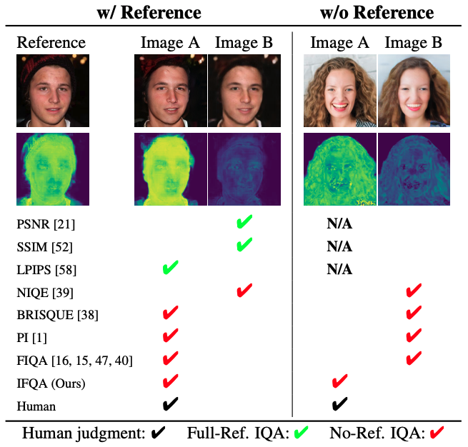

## IFQA - Official Pytorch Implementation [[Project Page]](https://sites.google.com/view/vcl-lab/publications/international-conference/ifqa_wacv23)


 
> **IFQA: Interpretable Face Quality Assessment**<br>
> Byungho Jo, Donghyeon Cho, In Kyu Park, Sungeun Hong<br>
> In IEEE/CVF Winter Conference on Applications of Computer Vision (WACV) 2023

> Paper: [WACV Proceeding](https://openaccess.thecvf.com/content/WACV2023/html/Jo_IFQA_Interpretable_Face_Quality_Assessment_WACV_2023_paper.html) <br>
> Video: [Youtube](https://www.youtube.com/watch?v=h21KM5qRAXs) <br>
> **Abstract:** *Existing face restoration models have relied on general assessment metrics that do not consider the characteristics of facial regions.
Recent works have therefore assessed their methods using human studies, which is not scalable and involves significant effort. This paper proposes a novel face-centric metric based on an adversarial framework where a generator simulates face restoration and a discriminator assesses image quality. Specifically, our per-pixel discriminator enables interpretable evaluation that cannot be provided by traditional metrics. Moreover, our metric emphasizes facial primary regions considering that even minor changes to the eyes, nose, and mouth significantly affect human cognition. Our face-oriented metric consistently surpasses existing general or facial image quality assessment metrics by impressive margins. We demonstrate the generalizability of the proposed strategy in various architectural designs and challenging scenarios. Interestingly, we find that our IFQA can lead to performance improvement as an objective function.*
> 
## We release IFQA++ model which is the Vision Transformer and pretrained on MAE.

## IFQA pre-trained model
- VIT-based Model: [Google Drive](https://drive.google.com/file/d/1yQ9n7oitvSQzkxwijGocpftW_SbHid7C/view?usp=sharing) 
- CNN-based Model [Google Drive](https://drive.google.com/file/d/1aHxF39Mdg4R2dFiF_yx8HsJHy9lJaEZP/view?usp=sharing)

Place the downloaded weight file in following directory: 
```bash
IFQA/
  ├── weights/
    ├── IFQA_Metric.pth
    ├── IFQA++_Metric.pth
```

## Requirements
* OS: Windows/Ubuntu
* 64-bit Python 3.7
* PyTorch 1.7.0 (or later). <!--See https://pytorch.org for PyTorch install instructions.-->
* Albumentations. <!--See https://albumentations.ai/ for Albumentations install instructions.-->

## Install dependencies
```shell
pip install -r requirements.txt
```

## Usage
IFQA is designed for evaluating the realness of faces. IFQA produces score maps of each pixel and we apply average to get final score.

You can produce quality scores using `test.py`. For example:
```.bash
# A single face image input.
python test.py --path=./docs/00021_Blurred.png

# All images within a directory.
python test.py --path=./docs
```
 

## Acknowledgements

We thank Eunkyung Jo for helpful feedback on human study design and Jaejun Yoo for constructive comments on various experimental protocols.
